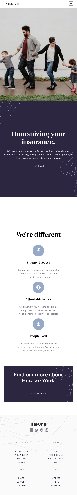

# Frontend Mentor - Insure landing page solution

This is a solution to the [Insure landing page challenge on Frontend Mentor](https://www.frontendmentor.io/challenges/insure-landing-page-uTU68JV8). Frontend Mentor challenges help you improve your coding skills by building realistic projects.

## Table of contents

- [Overview](#overview)
  - [The challenge](#the-challenge)
  - [Screenshot](#screenshot)
  - [Links](#links)
- [My process](#my-process)
  - [Built with](#built-with)
  - [What I learned](#what-i-learned)
  - [Continued development](#continued-development)
  - [Useful resources](#useful-resources)
- [Author](#author)
- [Acknowledgments](#acknowledgments)

## Overview

### The challenge

Users should be able to:

- View the optimal layout for the site depending on their device's screen size
- See hover states for all interactive elements on the page

### Screenshot

### Links

- Solution URL: [solution](https://github.com/mohamedyasser27/insure-landing-page)
- Live Site URL: [site](https://mohamedyasser27.github.io/insure-landing-page)

## My process

### Built with

- Mobile-first workflow
- Semantic HTML5 markup
- CSS custom properties
- Flexbox

### What I learned

- that position:absolute with no top/bottom/left/right sets where it was initially 

### Continued development
